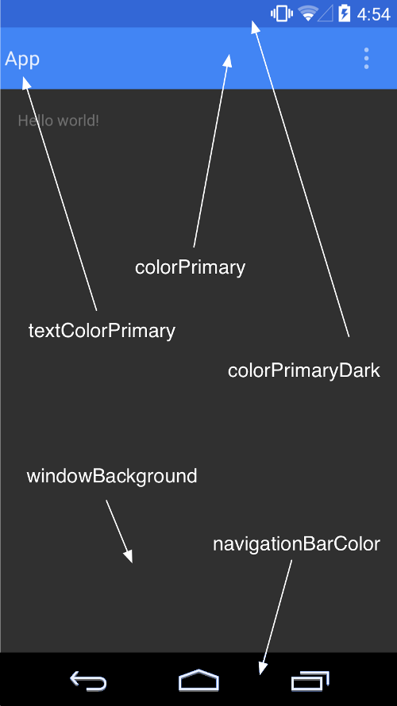

## Android System UI TOC

## Android System UI TOC

### Part 1 - Overview (김남훈님, 곽욱현님)
- Status Bar / Navigation Bar 소개
- PDK 딥 다이브 - System UI 리스트 
- System UI 실행 프로세스 (Android 11 기준)

### Part 2 - Full Screen Case (옥수환님, 이기정님)
- 전체화면 적용시 System ui 적용의 어려움
- 전체화면 종료 후 돌아오는 것
- cutout : https://developer.android.com/guide/topics/display-cutout
- Navigation 영역이 hardware냐 soft냐에 따른 동작

### Part 3 - Android api 30 practice (송시영님, 정세희님, 이기정님)
- Android 11 기준으로 insets / compat 관련 신규 기능 출시 대응