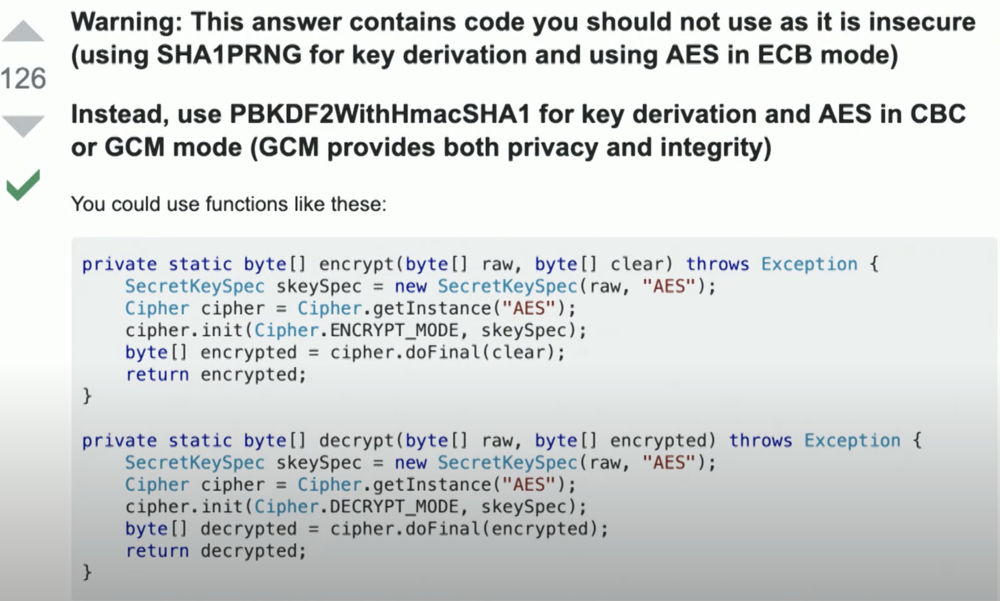
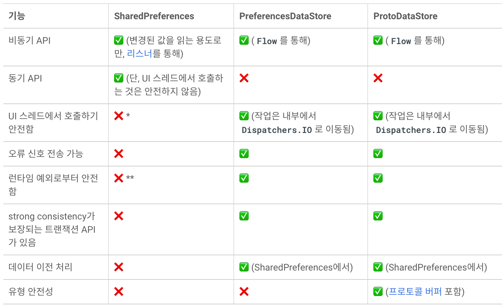

# Android Keystore와 Jetpack Security

고전적인 방식의 암호화/복호화를 하는 예제를 먼저 살펴보자.



이 방식은 틀렸다. 왜냐하면 암호화 키가 노출되기 때문이다. 근본적으로는 Android Keystore를 사용해야 한다.

## Android Keystore란?

보안에서는 키 관리가 매우 중요한데, 기기의 분실 및 도난으로 부터 내 키를 보호하기 힘들다. 그렇기 때문에 Android Keystore를 사용해야한다. Android Keystore는 하드웨어 기반이므로 기기의 별도의 메모리 공간에서 동작한다. 앱이 키에 접근할 수 있어도 앱이 키 자료를 알 수는 없다. 사용자는 이 키를 조작할 수 없다.

Android Keystore를 통한 기본적인 암/복호화는 다음과 같다.

```kotlin
val message = "Hello World!"
val alias = "Charles" // 아무거나 지정해도 상관없음.

// 키 생성 스펙 정의
val keyGenParameterSpec = KeyGenParameterSpec.Builder(alias, KeyProperties.PURPOSE_ENCRYPT or KeyProperties.PURPOSE_DECRYPT)
    .setBlockModes(KeyProperties.BLOCK_MODE_GCM)
    .setEncryptionPaddings(KeyProperties.ENCRYPTION_PADDING_NONE)
    .setKeySize(256)
    .build()

// 키 생성기 생성
val keyGenerator = KeyGenerator.getInstance(KeyProperties.KEY_ALGORITHM_AES, "AndroidKeyStore")
keyGenerator.init(keyGenParameterSpec)

// 생성 된 키
val secretKey: SecretKey = keyGenerator.generateKey()

// 암호화 방식 정의
val cipher = Cipher.getInstance("AES/GCM/NoPadding")
cipher.init(Cipher.ENCRYPT_MODE, secretKey)

// 초기화 벡터
val iv = cipher.iv

// 암호화 된 메시지 로그로 출력해보기
val encryptedData: ByteArray = cipher.doFinal(message.toByteArray())
Log.e(TAG, "encryption = ${encryptedData.decodeToString()}")

// 메세지를 복호화 하기 위해 안드로이드 키스토어를 가져옴
val keyStore = KeyStore.getInstance("AndroidKeyStore")
keyStore.load(null)

// 별칭(alias)을 통해 키를 가져옴
val secretKeyEntry = keyStore.getEntry(alias, null) as KeyStore.SecretKeyEntry
val secretKey2: SecretKey = secretKeyEntry.secretKey

// 복호화 방식 정의 (위 암호화 방식과 동일)
val cipher2 = Cipher.getInstance("AES/GCM/NoPadding")
val spec = GCMParameterSpec(128, iv)
cipher2.init(Cipher.DECRYPT_MODE, secretKey2, spec)

// 복호화 된 메시지 로그로 출력해보기
val decodedData: ByteArray = cipher2.doFinal(encryptedData)
Log.e(TAG, "decryption = ${decodedData.decodeToString()}")
```

## Jetpack Security

Jetpack Security라이브러리는 파일 또는 데이터를 읽고 쓰는 과정에 대한 암호화/복호화 솔루션을 제공한다.

Jetpack Security는 내부적으로 Tink와 Android Keystore를 사용한다. 

* Google Tink : 오용하기 쉽고 사용하기 어려운 암호화를 안전하고 그리고 올바르게 할 수 있도록 도와주는 라이브러리로 구글에서 관리하고 있다. 다중 언어, 교차 플랫폼 라이브러리로 안드로이드에 종속되지 않는다. 

Jetpack Security로 키를 만들 때 개발자는 보안과 관련된 내용을 상세히 알고 있지 않아도 된다. 또한 기기 별도의 하드웨어 부분인 스트롱 박스(Strong Box)라는 기능도 사용할 수 있다. 별도의 칩이므로 기술적인 면에서 약간 속도가 느릴 수 있으나 데이터 관리를 위한 매우 안전한 방법이고, 모든 작업이 별도의 메모리에서 이루어지므로 암호화/복호화 시 키가 앱으로 유출되지 않는다

Jetpack Security 에서는 키를 생성하여 키스토어를 입력 할 수 있는 마스터 키 클래스가 제공된다. 기본 설정으로 AES 256을 사용한다. GCM(예: MasterKeys.AES256_GCM_SPEC)을 사용하며 패딩을 사용하지 않는다. 안드로이드 앱개발자로서 유의해야 할 점은 반드시 키를 키스토어를 통해 만들고, 별칭(alias)을 통해 나중에 키를 찾을 수 있도록 한다.

Jetpack Security를 통해 키를 생성하는 방식은 다음과 같다.

```kotlin
// 앱 모듈의 build.gradle에 Jetpack Security 의존성 설정
dependencies {
    implementation("androidx.security:security-crypto:1.0.0")
}
```

```kotlin
// Jetpack Security사용하여 키 생성하기
val keyGenParameterSpec = MasterKeys.AES256_GCM_SPEC
val masterKeyAlias = MasterKeys.getOrCreate(keyGenParameterSpec)
```

getOrCreate의 내부를 살펴보면 위 예제 코드에서 KeyGenParameterSpec과 키를 생성하는 코드가 거의 동일한 것을 확인 할 수 있다.

## EncryptedSharedPreferences

일반적으로 SDK에서 제공하는 SharedPreferences 구현체를 사용하는 경우 데이터가 암호화 되지 않은 상태로 저장된다. 이를 보완하기 위해 Security라이브러리에서는 데이터 암호화를 기능을 추가한 SharedPreferences 구현체를 제공하는데 이것이 바로 EncryptedSharedPreferences다.

사용법은 기존과 거의 동일하며, 초기화시에 암호화 알고리즘 및 암호화 키를 전달해야 한다.

```java
  String masterKeyAlias = MasterKeys.getOrCreate(MasterKeys.AES256_GCM_SPEC);

  SharedPreferences sharedPreferences = EncryptedSharedPreferences.create(
      "secret_shared_prefs", // preferences 파일 이름
      masterKeyAlias, // 암호화 키
      context, 
      EncryptedSharedPreferences.PrefKeyEncryptionScheme.AES256_SIV, // 키에 대한 암호화 방식
      EncryptedSharedPreferences.PrefValueEncryptionScheme.AES256_GCM // 값에 애한 암호화 방식
  );

  // use the shared preferences and editor as you normally would
  SharedPreferences.Editor editor = sharedPreferences.edit();
```

## Datastore

Datastore는 개선된 신규 데이터 저장소 솔루션으로, SharedPreferences를 대체한다. Kotlin 코루틴과 Flow를 기반으로 한 Datastore는 두 가지 구현, 즉 타입 객체를 저장하는 Proto Datastore(프로토콜 버퍼로 지원) 및 키-값 쌍을 저장하는 Preferences Datastore를 제공한다. 

SharedPreferences에는 UI 스레드에서 사용하기에 안전해 보일 수 있지만 실제로는 디스크 I/O 작업을 하는 동기적인 API다. 그러므로 ANR이 발생할 소지가 있는데, Datastore는 비동기적이고 일관된 트랜잭션 방식으로 데이터를 저장하여 SharedPreferences의 단점을 일부 극복한다.

**DataStore의 특징** 

- 데이터 갱신을 트랜잭션 방식으로 처리
- 데이터 현재 상태를 Flow로 표현
- apply() 또는 commit()과 같은 data persistent 메서드가 없음
- 변경 될 수 있는 참조를 내부상태에 반환하지 않음
- Map 및 MutableMap 처럼 타입을 키로 하는 API를 제공함

다음의 도표를 통해 SharedPreferences와 DataStore의 차이점을 확인해보자.



