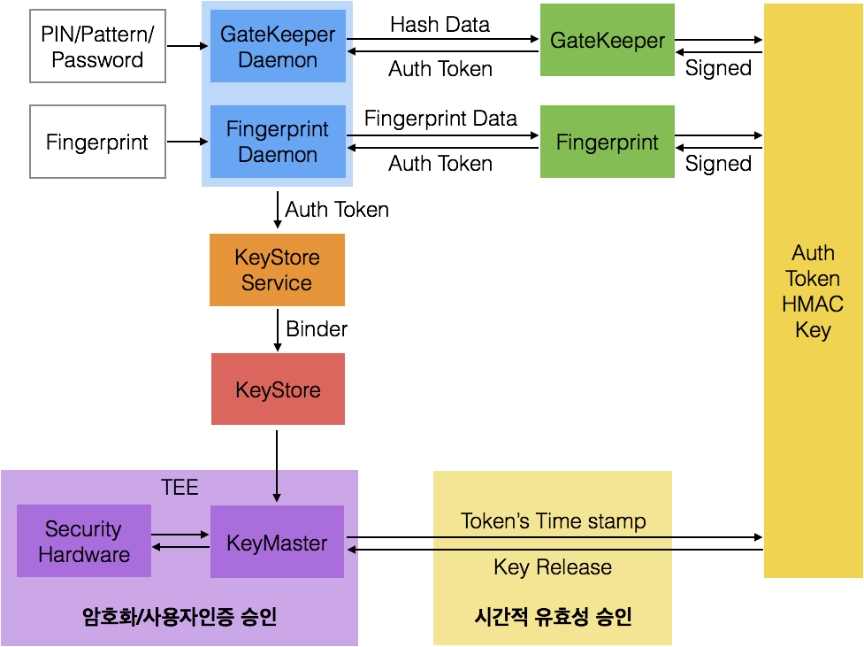
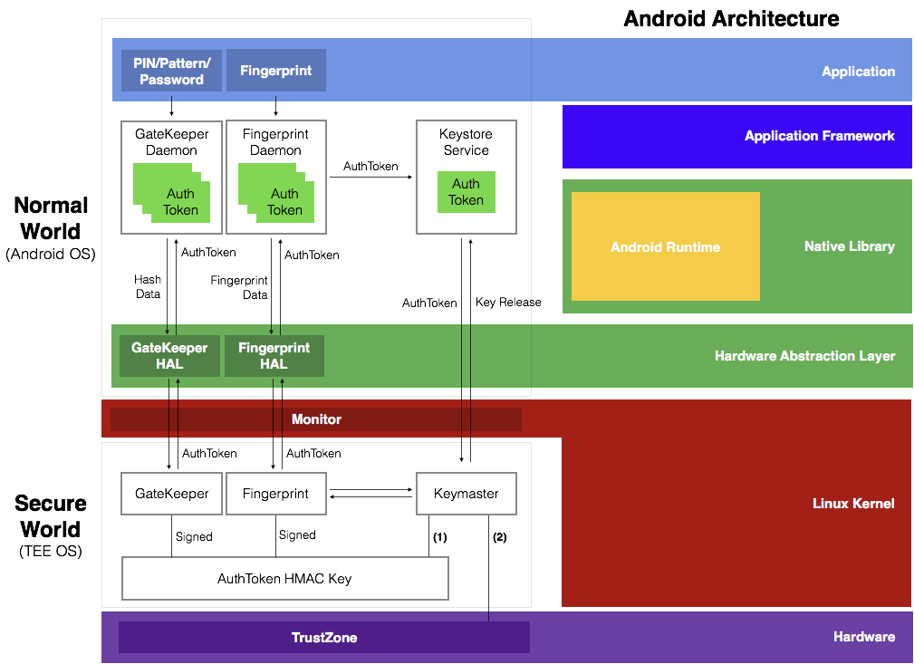

# Part 1 : What is KeyStore System?
- KeyStore 소개 및 동작 원리
- Tusted Executon Environment

### Android KeyStore Diagram

### Android KeyStore의 보안

Android KeyStore에 저장되는 key들의 구성요소는 아래와 같은 수단으로 보호된다.

1. Application 프로세스 레벨에서 Key Material의 접근은 전면 차단되며, System Process를 통해서만 siging등의 작업을 진행할 수 있다.
2. Plaintext, Cipher, message 등은 System Process를 통해서만 접근하여 받을 수 있다.

### Hardware 기반의 KeyStore

Android의 KeyStore는 필수적으로 하드웨어 기반으로만 구현된다.

하드웨어를 통한 보안 기능은 ARM TrustZone을 통해 진행되며, RSA, ECDSA, AES, HMAC Key들은 전부 하드웨어 기반의 TrustZone에 저장된다.

개발자는 TrustZone에 관련된 API를 사용하여 현재 Key가 신뢰할만한 하드웨어 장치에 저장되어있는 지 확인할 수 있으며, 지문 인증과 같은 사용자 본인의 인증없이는 특정 데이터를 Decrypt할 수 없게 구현할 수 있다.

### TEE

Android의 Key는  **TEE**(Tusted Executon Environment : 신뢰할 수 있는 실행환경)에서 바인딩되어 있으며 바인딩되어 있는 상태의 Key는 보안처리된 하드웨어 밖으로 절대 추출되지 않는다.

이 TEE는 디바이스의 메인 프로세서에 따로 할당되어 있는 영역으로 데이터의 무결성을 보장해주며, 보안 영역의 분리를 통해 해킹, 멀웨어, 루트 권한 접근으로부터 보호받을 수 있게 된다.

#### (1) 시간적 유효성 승인

GateKeeper/Fingerprint Daemon을 통해 생성한 AuthToken에 기록된 마지막 TimeStamp를 통해 시간적 유효성을 확인 후 승인한다.

#### (2) 암호화/사용자 인증 승인

Hardware 레벨에서 검증할 수 있는 수단을 통해 암호화 및 사용자 인증을 승인 한다.

* Android 7.0부터 모든 기기는 TrustZone을 탑재하며, 기기 자체에 해당 TrustZone에 접근할 수 있는 고유 Key를 지닌다.
* 위의 고유한 Key를 가지지 않으면 모든 접근은 차단된다.
